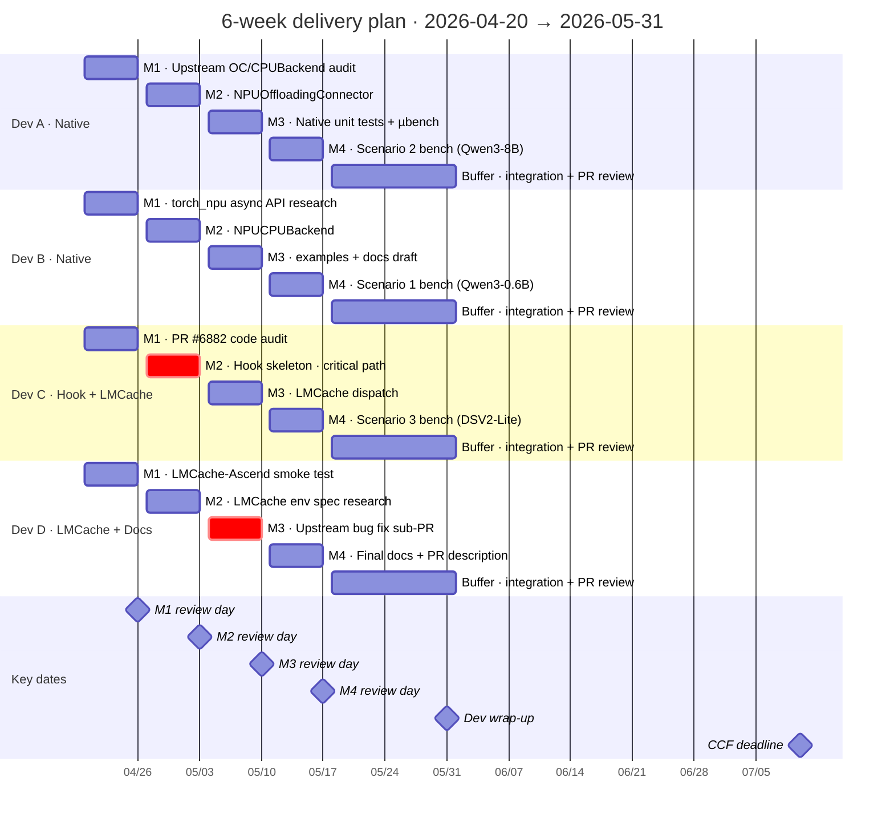
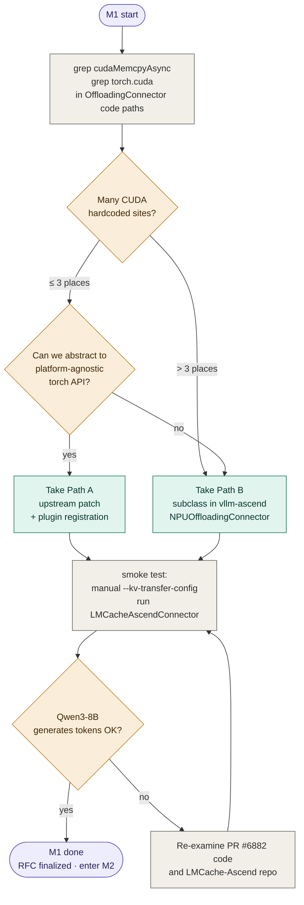
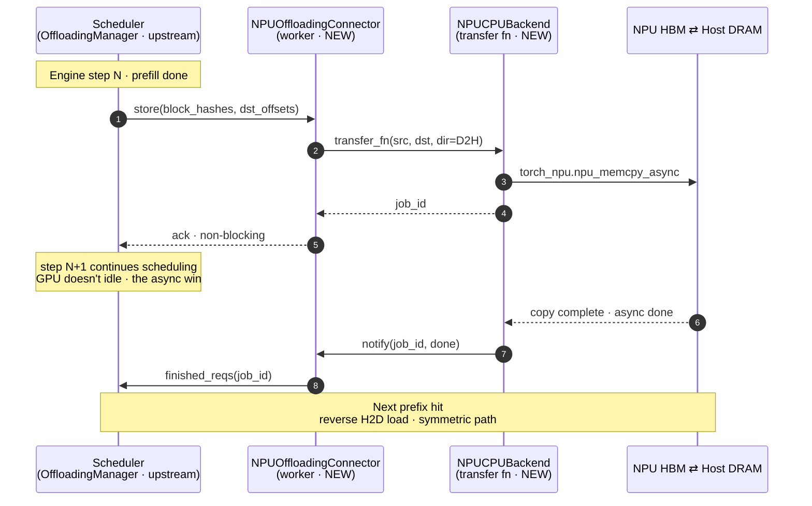
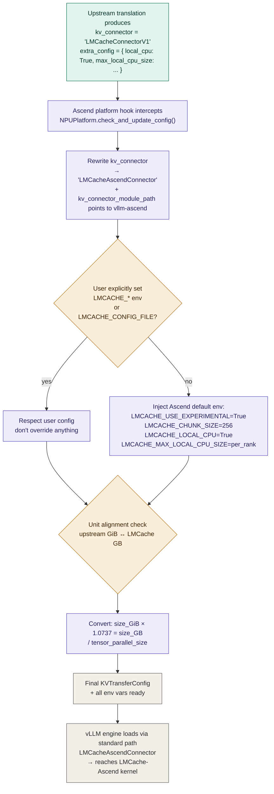
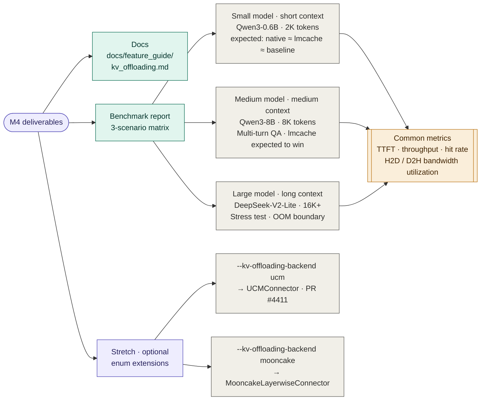

# RFC: Supporting `--kv-offloading-backend` top-level CLI on vllm-ascend

| Field | Value |
| --- | --- |
| Status | Draft |
| Target repo | `vllm-project/vllm-ascend` (+ minimal patch to `vllm-project/vllm` upstream) |
| Related upstream | RFC #26858 / PR #27621 / RFC #19854 / PR #24498 |
| Related vllm-ascend PRs | #1659 (CPUOffloadingConnector, **deprecated**) / #4411 (UCMConnector) / #6882 (LMCacheAscendConnector) |
| Covered flags | `--kv-offloading-backend {native\|lmcache}` + `--kv-offloading-size <GiB>` |
| Hardware | Atlas 800I A2 (Ascend 910B) |

---

## 0. TL;DR

Upstream vLLM merged PR #27621 on 2025-11-01, introducing two top-level CLI flags — `--kv-offloading-backend` and `--kv-offloading-size` — to replace the verbose `--kv-transfer-config '{...}'` JSON configuration. The current implementation translates these two flags into a `KVTransferConfig` inside `VllmConfig.__post_init__`: `native` → `OffloadingConnector` (uses `cudaMemcpyAsync`), `lmcache` → `LMCacheConnectorV1` (GPU class name hardcoded).

This upstream path **does not work out of the box on Ascend**: `native`'s `cudaMemcpyAsync` is CUDA-only; `lmcache`'s produced connector class name does not exist in the Ascend environment. This RFC proposes closing the loop via **two tracks, four Milestones**:

1. **Native track**: make upstream's `OffloadingConnector` + `CPUBackend` work on Ascend, either by going through a device-agnostic `torch` abstraction to `torch_npu.npu_memcpy`, or by injecting an `NPUOffloadingBackend` on the vllm-ascend side.
2. **LMCache track**: extend the translation layer so that under the Ascend platform, `lmcache` maps to `LMCacheAscendConnector` (the Ascend-side connector already landed in PR #6882), with correct LMCache env vars and connector extra config auto-filled, so users no longer need to handwrite JSON.

Both tracks share the same platform-aware dispatch mechanism. The core changes land on the `vllm-ascend` side (via a `Platform.check_and_update_config()` hook). Upstream only needs a minimal patch (drop GPU-only assumptions, push hardcoded config down into overridable defaults).

---

## 0.1 Architecture evolution

Three diagrams in sequence: **GPU baseline → current Ascend state → target architecture**. Shared visual encoding:

- **Border style**:
  - Solid = component exists and works
  - Dashed = new code added by this RFC, or a runtime crash state
- **Fill color**:
  - Gray = external boundary (user CLI / system runtime / hardware)
  - Teal = existing code
  - Purple = new code added by this RFC
  - Red = crash state

Deprecated/experimental status lives in the table below Figure 2, not as a color on the diagram.

### Figure 1: Upstream vLLM's current flow on GPU (baseline)

This is the full call chain that GPU users can run out of the box after PR #27621 merged. One CLI, two backends, both reaching CUDA DMA.

```mermaid
flowchart TD
    CLI["<b>User CLI</b><br/>--kv-offloading-backend native&#124;lmcache<br/>--kv-offloading-size N"]

    UP["<b>VllmConfig.&#95;&#95;post&#95;init&#95;&#95;</b><br/>translation layer · PR #27621"]

    OC["<b>OffloadingConnector</b><br/>native path"]
    LC["<b>LMCacheConnectorV1</b><br/>lmcache path"]

    CPUB["<b>CPUBackend</b><br/>cudaMemcpyAsync"]
    LCK["<b>LMCache CUDA kernel</b><br/>LMCache/LMCache repo"]

    CUDA["<b>CUDA runtime</b><br/>H2D / D2H via DMA"]

    GPU["<b>NVIDIA GPU</b><br/>HBM &nbsp;◄── PCIe / NVLink ──►&nbsp; Host DRAM"]

    CLI --> UP
    UP --> OC
    UP --> LC
    OC --> CPUB
    LC --> LCK
    CPUB --> CUDA
    LCK --> CUDA
    CUDA --> GPU

    classDef external fill:#F1EFE8,stroke:#5F5E5A,stroke-width:1px,color:#2C2C2A
    classDef existing fill:#E1F5EE,stroke:#0F6E56,stroke-width:1px,color:#04342C

    class CLI,CUDA,GPU external
    class UP,OC,LC,CPUB,LCK existing
```



The entire chain works out of the box on GPU. `CPUBackend` uses `cudaMemcpyAsync` to reach the GPU DMA hardware with near-zero CPU/GPU core overhead; `LMCacheConnectorV1` takes the LMCache CUDA kernel branch. The upstream blog (2026-01-08) reports measured 2x-22x TTFT speedup on single-request workloads.

### Figure 2: Current state of vllm-ascend (lower layers in place, CLI dispatch missing)

Same CLI on 910B: Figure 2a shows the path a user takes when following upstream docs verbatim (crash), Figure 2b shows the workaround the user actually has to take.

#### Figure 2a: the CLI path users expect — runtime crash on Ascend

```mermaid
flowchart LR
    CLI1["<b>User CLI</b><br/>--kv-offloading-backend<br/>native&#124;lmcache"]
    UP1["<b>VllmConfig.&#95;&#95;post&#95;init&#95;&#95;</b><br/>produces GPU-only config"]
    FAIL["<b>Runtime crash on NPU</b><br/>cudaMemcpyAsync not available<br/>LMCacheConnectorV1 class missing"]

    CLI1 --> UP1 -.->|GPU-only connector| FAIL

    classDef external fill:#F1EFE8,stroke:#5F5E5A,stroke-width:1px,color:#2C2C2A
    classDef existing fill:#E1F5EE,stroke:#0F6E56,stroke-width:1px,color:#04342C
    classDef crash fill:#FCEBEB,stroke:#A32D2D,stroke-width:1.5px,stroke-dasharray:5 5,color:#501313

    class CLI1 external
    class UP1 existing
    class FAIL crash
```



The translation layer is platform-unaware — whether the runtime is CUDA or NPU, `VllmConfig.__post_init__` produces GPU class names (`OffloadingConnector` or `LMCacheConnectorV1`). UP1's code itself works per spec; the crash happens in the seam between its output and the NPU runtime (the red dashed arrow).

#### Figure 2b: the workaround users actually take — expert mode with handwritten JSON

```mermaid
flowchart TD
    CLI2["<b>User CLI (expert mode)</b><br/>--kv-transfer-config '{&quot;kv_connector&quot;:&quot;LMCacheAscendConnector&quot;,...}'<br/>+ manually exported LMCACHE_&#42; env vars"]
    LMA["<b>LMCacheAscendConnector</b><br/>PR #6882 · v0.17.0rc1"]
    TNPU["<b>torch&#95;npu runtime</b>"]
    HW["<b>Atlas 800I A2 · Ascend 910B</b>"]

    CLI2 --> LMA --> TNPU --> HW

    classDef external fill:#F1EFE8,stroke:#5F5E5A,stroke-width:1px,color:#2C2C2A
    classDef existing fill:#E1F5EE,stroke:#0F6E56,stroke-width:1px,color:#04342C

    class CLI2,TNPU,HW external
    class LMA existing
```



Figure 2b only draws `LMCacheAscendConnector` as the representative. The Ascend side has three usable offload connectors, all triggered through the same JSON workaround, with different statuses:

| Connector | PR | Status | Notes |
| --- | --- | --- | --- |
| `LMCacheAscendConnector` | #6882 | landed in v0.17.0rc1 | The `lmcache` backend in this RFC points here |
| `CPUOffloadingConnector` | #1659 | deprecated in v0.16.0rc1 | Officially slated for replacement by "the upstream CPUOffload feature" — but that feature (the `OffloadingConnector` + `CPUBackend` in Figure 1) doesn't work on NPU yet, so the migration chain breaks mid-link |
| `UCMConnector` | #4411 | experimental | Enterprise-grade tiered storage, out-of-scope (see F1 in Section 11) |

Figure 2a's `CLI → translation` and Figure 2b's `... → LMCacheAscendConnector → torch_npu → 910B` both already exist independently. Missing is the platform-aware dispatch in between — i.e. the purple hook in Figure 3.

### Figure 3: target architecture of this RFC

Insert a platform hook inside `NPUPlatform.check_and_update_config()` that **intercepts the GPU-only config produced by the upstream translation layer and rewrites it for Ascend**. The two backends land on: native → newly-written `NPUOffloadingConnector` + `NPUCPUBackend`; lmcache → existing `LMCacheAscendConnector` + `LMCache-Ascend kernel`.

```mermaid
flowchart TD
    CLI["<b>User CLI</b><br/>--kv-offloading-backend native&#124;lmcache<br/>--kv-offloading-size N"]

    UP["<b>Upstream vLLM translation layer</b><br/>VllmConfig.&#95;&#95;post&#95;init&#95;&#95;<br/>(PR #27621, merged 2025-11-01)"]

    Hook["<b>vllm-ascend platform hook &nbsp;·&nbsp; this RFC</b><br/>NPUPlatform.check&#95;and&#95;update&#95;config()<br/>— rewires config for Ascend —"]

    NPUConn["<b>NPUOffloadingConnector</b><br/>native path &nbsp;·&nbsp; new"]
    LMConn["<b>LMCacheAscendConnector</b><br/>lmcache path &nbsp;·&nbsp; PR #6882"]

    NPUBack["<b>NPUCPUBackend</b><br/>torch&#95;npu async copy"]
    LMKernel["<b>LMCache-Ascend kernel</b><br/>LMCache/LMCache-Ascend repo"]

    TorchNPU["<b>torch&#95;npu runtime</b><br/>H2D / D2H transfer"]

    HW["<b>Atlas 800I A2 &nbsp;·&nbsp; Ascend 910B</b><br/>NPU HBM &nbsp;◄── PCIe Gen4 x16 ──►&nbsp; Host DRAM"]

    CLI --> UP
    UP --> Hook
    Hook --> NPUConn
    Hook --> LMConn
    NPUConn --> NPUBack
    LMConn --> LMKernel
    NPUBack --> TorchNPU
    LMKernel --> TorchNPU
    TorchNPU --> HW

    classDef external fill:#F1EFE8,stroke:#5F5E5A,stroke-width:1px,color:#2C2C2A
    classDef existing fill:#E1F5EE,stroke:#0F6E56,stroke-width:1px,color:#04342C
    classDef newcode  fill:#EEEDFE,stroke:#534AB7,stroke-width:1.5px,stroke-dasharray:5 5,color:#26215C

    class CLI,TorchNPU,HW external
    class UP,LMConn,LMKernel existing
    class Hook,NPUConn,NPUBack newcode
```



Figure 3 eliminates the CLI choice from Figure 2 — the same `--kv-offloading-backend` reaches the correct Ascend connector without handwritten `--kv-transfer-config` JSON. The `native` column (Hook / NPUOffloadingConnector / NPUCPUBackend) is all dashed purple (new code); the `lmcache` column (LMCacheAscendConnector / LMCache-Ascend kernel) is all solid teal (wire existing code). This determines M2's heavier load relative to M3 (see Section 8 plan). `CPUOffloadingConnector` and `UCMConnector` do not appear in Figure 3: the former is being removed; the latter is an out-of-scope stretch goal (see O3 in Section 3.2 and F1 in Section 11).

---

## 0.2 Core assumptions to verify on M1 Day 1

The entire Hook-based design depends on the following three assumptions. If any of them fails verification on M1 Day 1, Section 6 needs to be rewritten and M2's scope adjusted. **These are M1's highest-priority tasks, ahead of all other audit work.**

| ID | Assumption | Verification method | If it fails |
| --- | --- | --- | --- |
| **A1** | `NPUPlatform.check_and_update_config()` is called *after* `VllmConfig.__post_init__` and *before* the engine instantiates connectors | Grep for `check_and_update_config` call sites in vLLM source; verify its order relative to `KVConnectorFactory.create_connector_v1()` (or equivalent factory) | Hook-based rewrite writes to thin air. Must switch approach (e.g. monkey-patch `CacheConfig` defaults, or intercept at `EngineArgs` layer) |
| **A2** | vLLM loads connectors via `importlib.import_module(kv_connector_module_path)` + `getattr`, not via `@register_kv_connector` global registry | Grep for `kv_connector_module_path` usage in vLLM source; confirm dynamic import rather than registry lookup | Need to register `NPUOffloadingConnector` into the registry inside vllm-ascend's plugin entry — scope grows by one item |
| **A3** | `vllm/distributed/kv_transfer/kv_connector/v1/offloading_connector.py` has no module-level CUDA-only imports (e.g. `import torch.cuda; from torch.cuda import Stream`) | `grep -n "^import\|^from" <file>` — check the top 10 lines | `class NPUOffloadingConnector(OffloadingConnector)` fails at import. Must either copy the class skeleton wholesale on the vllm-ascend side, or first land an upstream PR pushing CUDA imports down into methods |

**M1 Day 1 deliverable**: an `m1-day1-assumptions.md` documenting A1/A2/A3 verification (grep commands + found code locations + conclusion). Dev A owns A3; Dev C owns A1 and A2. Only after these three pass do we start the other audit tasks in Section 8's M1 allocation.

The following secondary assumptions should be verified in parallel during M1, closing out the "TBD" items currently scattered through the RFC:

| ID | Currently marked in RFC | M1 decision |
| --- | --- | --- |
| A4 | Section 5.1: whether `CPUBackend.transfer_function` is hardcoded CUDA is "TBD" | `grep -n "cudaMemcpyAsync\|torch.cuda" vllm/distributed/kv_transfer/kv_connector/v1/offloading_connector.py` |
| A5 | Section 7.2: `kv_connector_module_path` exact path is "TBD from PR #6882 audit" | `grep -r "LMCacheAscendConnector" vllm-ascend/` |
| A6 | Section 7.3: `LMCACHE_MAX_LOCAL_CPU_SIZE` unit is "TBD, reconcile with upstream GB/GiB" | Read LMCache repo's `config.py` and env parser; combined with PR #27621 review clarification (upstream is GiB) determine conversion factor |

---

## 1. Background

### 1.1 Problem origin

vLLM v1 started incrementally building KV offloading capabilities from mid-2025, primarily through the **`OffloadingConnector` + `OffloadingManager`** framework introduced by RFC #19854 (author: orozery @ Red Hat). Core abstractions:

- **Scheduler side**: `OffloadingConnector` delegates to `OffloadingManager`, which handles allocation and eviction bookkeeping for offloaded data. Output is passed to workers via `KVConnectorMetadata`.
- **Worker side**: `OffloadingConnector` parses load/store requests and executes them asynchronously on a set of threads (one per transfer direction: GPU→CPU, CPU→GPU, with CPU→Disk as a future addition).
- **Backend abstraction**: ships with a `CPUBackend`; adding a new backend only requires implementing the transfer function (KV data copy between two media).

### 1.2 CLI sugar layer (RFC #26858)

RFC #26858 was proposed by ApostaC on 2025-10-15, motivated by: *"in order to enable CPU offloading, the user needs to pass a JSON string to `--kv-transfer-config`, which may create a huge mental barrier for new users."*

The proposal added two top-level CLI flags:
- `--kv-offloading-size <GB>`: global offload buffer size (summed across all ranks when TP>1)
- `--kv-offloading-backend {native|lmcache|...}`: backend enum

PR #27621 (merged 2025-11-01) implemented this CLI. The enum is currently constrained to `Literal["native", "lmcache"]`, defaulting to `native`. A follow-up PR #24498 merged `OffloadingConnector: Add cpu_bytes_to_use configuration`, which actually wires `--kv-offloading-size` into `OffloadingConnector`.

### 1.3 Current state on the Ascend side

vllm-ascend has three connectors that correspond to upstream (in landing order):

| Connector | PR | Version | Status | Purpose |
| --- | --- | --- | --- | --- |
| `CPUOffloadingConnector` | #1659 | v0.10.2 → v0.16.0rc1 deprecated | **Being removed** | Early NPU → CPU DRAM offload, marked as "superseded by upstream CPUOffload feature" |
| `UCMConnector` | #4411 | experimental since v0.13.0 | Alive | Unified Cache Management, tiered storage (local DRAM + 3FS / enterprise storage), enterprise-oriented |
| `LMCacheAscendConnector` | #6882 | v0.17.0rc1 | Alive | New KV cache pooling, paired with the LMCache-Ascend repo |

In parallel, the LMCache community maintains an independent `LMCache/LMCache-Ascend` repo that provides Ascend-specific kernels and integration examples. The current examples require users to manually:
1. Set envs like `LMCACHE_LOCAL_CPU=True` / `LMCACHE_CHUNK_SIZE=256` / `LMCACHE_MAX_LOCAL_CPU_SIZE=5.0`;
2. Handwrite `--kv-transfer-config '{"kv_connector":"LMCacheAscendConnector","kv_role":"kv_both"}'`.

### 1.4 The core gap

**Upstream has converged the user interface down to two CLI flags, but the translation layer only knows about GPU-side implementations.** On Ascend, the lower-level connectors (LMCacheAscendConnector, UCMConnector, etc.) are all in place, but users still have to enter "expert mode" — writing JSON and env vars by hand. That's exactly the gap this RFC closes.

---

## 2. Motivation

1. **Remove the mental barrier for Ascend users**: RFC #26858's original motivation applies equally to NPU users. `--kv-offloading-backend lmcache --kv-offloading-size 40` should just work.
2. **Avoid vllm-ascend maintaining an "Ascend-only CLI" long-term**: if upstream defines a standard interface, Ascend should comply rather than fork. This is echoed by PR #1659's author lidenghui1110 in comments: *"for long term support, I think we'd better move the feature to vLLM, since this is a common enhancement."*
3. **Expose existing Ascend connectors via upstream CLI**: `UCMConnector` and `MooncakeLayerwiseConnector` currently require JSON workaround to trigger. Wiring them into the `--kv-offloading-backend` enum makes them first-class alongside `native` / `lmcache`.

---

## 3. Goals & Non-Goals

### 3.1 In Scope

- **G1**: `--kv-offloading-backend native --kv-offloading-size N` runs end-to-end on Ascend, functionally equivalent to the GPU-side `OffloadingConnector` + CPU backend, with measurable TTFT metrics.
- **G2**: `--kv-offloading-backend lmcache --kv-offloading-size N` runs end-to-end on Ascend, connecting to `LMCacheAscendConnector` without requiring users to write envs or JSON by hand.
- **G3**: The platform-aware dispatch mechanism should be clean enough to accommodate future Ascend backends (`ucm`, `mooncake`) without introducing upstream hardcoding.
- **G4**: Deliver the `examples/` + `docs/` + `tests/` triad. Benchmarks should align with the metric vocabulary from the GPU-side vLLM blog (2026-01-08): TTFT / throughput, single-request / multi-request.

### 3.2 Out of Scope

- **O1**: Layerwise KV offloading (corresponds to upstream RFC #33398) — independent feature, separate RFC.
- **O2**: Sparse attention KV offloading (RFC #33980).
- **O3**: CLI support for `mooncake`, `3fs`, `nixl`, and other backends — can be follow-up work, does not block this RFC.
- **O4**: UB/MemFabric high-bandwidth channel for the native backend (depends on CloudMatrix/910C hardware; 910B has no such interconnect).
- **O5**: KV transfer in PD-disaggregation scenarios — already solved by `MooncakeConnectorV1` / `AscendStoreConnector` etc., orthogonal to the offloading path.

### 3.3 Non-functional goals

- Zero regression for existing users: workloads that don't set `--kv-offloading-*` behave exactly as before.
- The translation-layer Ascend dispatch must not monkey-patch upstream code directly; it must use plugin APIs like `Platform.check_and_update_config()`.
- **LMCache backend kill-criterion**: in M4 benchmark scenario 2 (Qwen3-8B · 8K · multi-turn QA), `lmcache` must deliver ≥ 20% TTFT improvement over `native`. If benchmark shows < 20%, `lmcache` is demoted from G2 (in-scope) to a follow-up (F4-tier); M3's LMCache dispatch code can be kept but must not be called out in release notes. This gives benchmarks a hard veto criterion and prevents shipping a feature that exists but has no value.

### 3.4 Top-level acceptance criteria

This RFC is considered complete when **all** of the following hold:

1. **Code merged**: main branch of `vllm-project/vllm-ascend` has `NPUOffloadingConnector` + `NPUCPUBackend` + the dispatch changes in `NPUPlatform.check_and_update_config()` merged.
2. **Exposed in a release**: `vllm-ascend` has a tagged release (target v0.18.x, actual version TBD) whose release notes explicitly mention Ascend support for `--kv-offloading-backend {native|lmcache}`.
3. **Documentation landed**: `vllm-ascend/docs/source/user_guide/feature_guide/kv_offloading.md` exists, covering CLI usage, backend selection guidance, and benchmark summary.
4. **Migration guide exists**: **users currently running `CPUOffloadingConnector`** have a clear migration note (see F6 in Section 11) explaining whether the new CLI is behaviorally equivalent.
5. **Benchmark passes the kill-criterion in 3.3** (or `lmcache` is formally demoted, not shipped ambiguously).

---

## 4. Upstream current implementation

### 4.1 End-to-end call chain

```
User CLI flag
  ↓
EngineArgs.kv_offloading_backend / kv_offloading_size
  ↓
CacheConfig.{kv_offloading_backend, kv_offloading_size}  (vllm/config/cache.py)
  ↓
VllmConfig.__post_init__  (vllm/config/vllm.py)
  ↓ (translation layer)
KVTransferConfig {kv_connector=..., kv_connector_extra_config={...}}
  ↓
engine startup loads connector via standard path
  ↓
OffloadingConnector (scheduler) ⇔ OffloadingManager
      ↓
OffloadingConnector (worker) + Backend (CPUBackend / LMCacheConnectorV1Impl / ...)
      ↓
H2D / D2H transfer (cudaMemcpyAsync on GPU, via DMA)
```

### 4.2 Native backend implementation details

The `native` branch in the translation layer produces something like:

```python
KVTransferConfig(
    kv_connector="OffloadingConnector",
    kv_role="kv_both",
    kv_connector_extra_config={"cpu_bytes_to_use": kv_offloading_size * 1e9},
)
```

On the worker side, `OffloadingConnector` initializes `CPUBackend`, whose transfer function uses `cudaMemcpyAsync` → GPU DMA hardware with zero CPU/GPU core overhead. This is the design point the upstream blog (2026-01-08) keeps emphasizing: "DMA offers the best throughput when handling large physically-contiguous copies."

**Key properties**:
- Async: async save means GPU memory is not immediately released while new KV is copied from GPU to cache (similar to `NixlConnector`); async load means requests waiting on cache load aren't scheduled until the load completes. This is the fundamental difference from V0 swap and early LMCache.
- Hash reuse: PR #19728 moved `block_hashes` from `KVCacheManager` to `Request`, so `OffloadingManager` can reuse them directly without recomputing prefix cache hashes.

### 4.3 LMCache backend implementation details

The `lmcache` branch produces something like:

```python
KVTransferConfig(
    kv_connector="LMCacheConnectorV1",   # <-- GPU class name hardcoded
    kv_role="kv_both",
    kv_connector_extra_config={
        "lmcache.local_cpu": True,       # <-- hardcoded in vllm/config/vllm.py
        "lmcache.max_local_cpu_size": kv_gb_per_rank,
    },
)
```

**There's a known bug here**: after PR #27621 merged, leelavg reported on 2026-02-04 in PR comments that the "babysitting" code at `vllm/config/vllm.py:559-562` unconditionally injects `local_cpu=True`, which causes:
- Backends like nixl that don't need local CPU incur an extra hop;
- Users' LMCache YAML cannot override the default;
- `--kv-offloading-backend=lmcache --kv-offloading-size=0.01` fails to start at all.

This bug needs to be fixed at the upstream level — it's a general issue, not Ascend-specific. Our Ascend adaptation should fix this dead-end path as part of the same effort.

### 4.4 Translation layer injection timing

During PR #27621 review, hmellor suggested collapsing the translation logic from a standalone `config_parser.py` into `VllmConfig.__post_init__`, shrinking LoC from 160+ to 28 (and tests from 236 to 65). This means the current hook point **is singular**: the `if cache_config.kv_offloading_size is not None: ...` block inside `VllmConfig.__post_init__`.

vllm-ascend's plugin entry point is `vllm_ascend.platform.NPUPlatform.check_and_update_config(vllm_config)`, which is called by the engine **after** `VllmConfig.__post_init__`. What we need to do is, inside this hook, perform a second-pass correction on the `kv_transfer_config` that has already been "polluted" by upstream translation.

---

## 5. Gap analysis: vllm-ascend vs. upstream

### 5.1 Native track gaps

| Item | Upstream implementation | Availability on Ascend | Gap |
| --- | --- | --- | --- |
| `OffloadingConnector` itself | Platform-neutral Python scheduling logic | Should be reusable (**speculation, needs code audit**) | Minimal, likely no change needed |
| `OffloadingManager` bookkeeping | Uses block hash, platform-neutral | Should be reusable (**speculation, needs code audit**) | Minimal |
| `CPUBackend.transfer_function` | `cudaMemcpyAsync` | ❌ CUDA-only, crashes on NPU | **Main gap** |
| Worker threading model | `torch.cuda.Stream` etc. | Needs corresponding `torch.npu.Stream` / torch_npu | Medium gap, needs verification |
| Block-layout assumptions | Depends on actual attention backend layout | Ascend attention backend layouts differ slightly | Needs verification |

**The biggest unknown**: whether `CPUBackend.transfer_function` in upstream code is truly hardcoded CUDA API, or already uses device-agnostic patterns like `torch.Tensor.to("cpu", non_blocking=True)`. In this RFC draft I'm marking it as **TBD** — the first Milestone is to clone upstream main and grep `cudaMemcpyAsync` / `torch.cuda` in paths related to `vllm/distributed/kv_transfer/kv_connector/v1/offloading_connector.py`.

### 5.2 LMCache track gaps

| Item | Upstream implementation | Availability on Ascend | Gap |
| --- | --- | --- | --- |
| `LMCacheConnectorV1` class | In LMCache main repo, CUDA-bound | ❌ Class doesn't exist / doesn't adapt to NPU | Main gap |
| `LMCacheAscendConnector` class | - | ✅ Already landed in vllm-ascend PR #6882 | Zero gap (exists) |
| Translation layer mapping | `lmcache` → `"LMCacheConnectorV1"` | Needs to become `"LMCacheAscendConnector"` under Ascend platform | Main gap |
| LMCache env auto-injection | hardcodes `local_cpu=True` | Also needed for Ascend; but hardcoding is a bug | Medium gap, fix as a side quest |
| LMCache kernel | CUDA | LMCache-Ascend has a torch_npu version | Exists, needs integration path confirmation |

**The bulk of the work here isn't reinventing the wheel, it's wiring**: connecting the upstream `lmcache` enum to the `LMCacheAscendConnector` on the Ascend side.

### 5.3 Shared gap

Both tracks share the same platform dispatch mechanism. Currently, the upstream translation layer has **no platform awareness** — regardless of whether the runtime device is CUDA or NPU, it produces identical config. Ascend must do a **second-pass correction** inside `NPUPlatform.check_and_update_config()`, rewriting the upstream's GPU-only config into an Ascend-compatible one.

---

## 6. Native track design

### 6.1 Problem statement

The user runs:
```bash
vllm serve Qwen/Qwen3-8B --kv-offloading-backend native --kv-offloading-size 40
```
Expectation: KV cache can offload to host DRAM, NPU HBM gets freed, and on the next request hitting the same prefix, TTFT drops noticeably.

### 6.2 Two candidate implementation paths

#### Path A: inject a platform hook upstream (recommended)

Inside upstream's `OffloadingConnector`'s `CPUBackend`, replace `cudaMemcpyAsync` with the device-agnostic `torch.Tensor.to()` form (if actual measurements show the overhead is acceptable), or provide a `get_h2d_memcpy_fn(device_type)` registration point. Then vllm-ascend, during plugin registration, registers the NPU version (using `torch_npu.npu_memcpy_async` or equivalent).

- **Pro**: cleanest solution; other platforms (XPU / Gaudi / TPU) can reuse the same mechanism.
- **Con**: requires an upstream PR; review cycle is out of our control. The contest time window (until 2026-07-10) carries risk.

#### Path B: subclass and override on the vllm-ascend side (fallback)

Create a new `NPUOffloadingConnector(OffloadingConnector)` subclass on the vllm-ascend side, overriding only the transfer-function layer. Then the translation layer, under the Ascend platform, maps `native` to `NPUOffloadingConnector` instead of `OffloadingConnector`.

- **Pro**: zero upstream review dependency, fast iteration.
- **Con**: it's an "Ascend-specific class" with long-term maintenance cost; if upstream changes the parent class, silent drift is a risk.

#### Recommended strategy

**Milestone M1 takes Path B for fast availability validation**, while simultaneously opening a draft PR upstream for Path A. If the upstream PR merges before 2026-06, switch back to Path A; otherwise, ship with Path B and document it as "Ascend temporary solution, to be unified after vLLM X.Y merges".

**If M1 audit determines Path A is feasible** (A3 passes, and `CPUBackend` has ≤ 3 CUDA hardcoded sites), M2 allocation shifts accordingly:

| Original Path B allocation | Switched to Path A |
| --- | --- |
| Dev A: write `NPUOffloadingConnector` subclass | Dev A: open upstream PR replacing `cudaMemcpyAsync` in `CPUBackend` with device-agnostic calls |
| Dev B: write `NPUCPUBackend` | Dev B: register NPU transfer function in vllm-ascend plugin entry |
| Dev C: Hook skeleton (native branch only) | Dev C: Hook skeleton only does connector-name mapping, no module-path rewrite |

Under Path A, M2's **main risk** shifts from "code written" to "upstream review cycle". If the Path A upstream PR isn't merged by end of M3 (5/10), Week 5 buffer has to absorb the "fall back to Path B" rewrite work, **which is strictly higher risk than staying on Path B throughout**. So the default remains Path B, with Path A pursued opportunistically in parallel.

### 6.3 Core code changes (Path B)

```
vllm_ascend/
├── platform.py
│   └── NPUPlatform.check_and_update_config(vllm_config)  # New dispatch
├── distributed/kv_transfer/
│   ├── offloading_connector_npu.py  # New: NPUOffloadingConnector
│   └── cpu_backend_npu.py           # New: NPUCPUBackend (torch_npu version)
└── tests/kv_transfer/
    └── test_offloading_native.py    # New
```

Platform hook skeleton (illustrative, not final code):

```python
# vllm_ascend/platform.py
@classmethod
def check_and_update_config(cls, vllm_config: VllmConfig) -> None:
    # Existing Ascend config checks...
    super().check_and_update_config(vllm_config)

    # New: KV offloading dispatch
    cc = vllm_config.cache_config
    if cc.kv_offloading_size is not None:
        _rewire_kv_offloading_for_ascend(vllm_config)


def _rewire_kv_offloading_for_ascend(vllm_config):
    """Rewrite the GPU-only KVTransferConfig produced by upstream translation into the Ascend version."""
    backend = vllm_config.cache_config.kv_offloading_backend
    ktc = vllm_config.kv_transfer_config
    if backend == "native":
        ktc.kv_connector = "NPUOffloadingConnector"
        ktc.kv_connector_module_path = \
            "vllm_ascend.distributed.kv_transfer.offloading_connector_npu"
    elif backend == "lmcache":
        _rewire_lmcache_for_ascend(ktc)
```

### 6.4 Risks

- **R1**: Do `torch_npu`'s H2D async copy semantics align with `cudaMemcpyAsync` (particularly the stream + event ordering guarantees)? Needs early-M1 micro-benchmark verification.
- **R2**: 910B's H2D bandwidth is bounded by PCIe Gen4 x16 (theoretical peak ~32 GB/s unidirectional). Compared to H100 PCIe 80GB (~64 GB/s) there's still a generational gap, so the "2x-22x TTFT speedup" from the GPU blog has to be re-measured on 910B. Expect speedup to come in a tier lower.
- **R3**: Does the deprecated `CPUOffloadingConnector` in vllm-ascend v0.16.0rc1 have reusable H2D transfer logic? If so, M1 could port it over rather than writing from scratch. **Needs code-level review of PR #1659.**

---

## 7. LMCache track design

### 7.1 Problem statement

The user runs:
```bash
vllm serve Qwen/Qwen3-8B --kv-offloading-backend lmcache --kv-offloading-size 40
```
Expectation: the system automatically uses `LMCacheAscendConnector` under the hood, LMCache envs get sensible defaults injected, users don't need to touch `LMCACHE_*` env vars or write `--kv-transfer-config` JSON.

### 7.2 Ascend-side rewiring in the translation layer

Inside `_rewire_lmcache_for_ascend`:

1. Change `ktc.kv_connector` from `"LMCacheConnectorV1"` to `"LMCacheAscendConnector"`;
2. Ensure `ktc.kv_connector_module_path` points to the right place (e.g. `vllm_ascend.distributed.kv_transfer.lmcache_ascend_connector`, **exact path TBD from PR #6882 code audit**);
3. Fix the hardcoded `local_cpu=True` upstream — on the Ascend side, change it to "only inject default if the user hasn't provided `LMCACHE_CONFIG_FILE`".

### 7.3 LMCache env injection strategy

LMCache depends on a group of `LMCACHE_*` env vars. Ascend adaptation needs at minimum:

| Env | Meaning | Ascend recommended default |
| --- | --- | --- |
| `LMCACHE_USE_EXPERIMENTAL` | Enable LMCache experimental branch | `True` (matches LMCache-Ascend examples) |
| `LMCACHE_CHUNK_SIZE` | Tokens per KV chunk | `256` (aligned with block_size, TBD) |
| `LMCACHE_LOCAL_CPU` | Enable local CPU backend | `True` |
| `LMCACHE_MAX_LOCAL_CPU_SIZE` | Local CPU capacity (GB) | = `kv_offloading_size / tp_size` (per-rank; **needs unit reconciliation with upstream's GB vs GiB**) |

**Units and TP semantics (decided)**:
- Upstream `kv_offloading_size` unit is **GiB** (clarified during PR #27621 review).
- LMCache `LMCACHE_MAX_LOCAL_CPU_SIZE` unit is **GB**.
- Upstream `--kv-offloading-size` semantics: **global total** (summed across all ranks); the translation layer divides by `tensor_parallel_size` internally to get per-rank.
- Therefore the conversion inside `_rewire_lmcache_for_ascend`: `LMCACHE_MAX_LOCAL_CPU_SIZE = (kv_offloading_size_GiB × 1.0737) / tensor_parallel_size`. The 1.0737 = 1024³ / 10⁹ (GiB → GB conversion factor).

M1 Day 1 should double-check LMCache's actual env unit — if LMCache also uses GiB, the 1.0737 factor is dropped. Record the result in the M1 deliverable `m1-day1-assumptions.md` under A6.

### 7.4 Respect explicit user config

If a user provides `LMCACHE_CONFIG_FILE=xxx.yaml` or any `LMCACHE_*` env, the translation layer **must not override** — this is the core of the leelavg-reported bug. Direction of the fix:

```python
def _inject_lmcache_defaults(extra_config, kv_gb_per_rank):
    # Only inject defaults when user hasn't provided a config file AND hasn't set env explicitly
    if os.environ.get("LMCACHE_CONFIG_FILE"):
        return
    if "lmcache.local_cpu" not in extra_config:
        extra_config["lmcache.local_cpu"] = True
    if "lmcache.max_local_cpu_size" not in extra_config:
        extra_config["lmcache.max_local_cpu_size"] = kv_gb_per_rank
```

This change belongs **at the upstream level** (it affects GPU users too, not just Ascend). Recommended to submit as a standalone sub-PR.

### 7.5 Risks

- **R4**: Is `LMCacheAscendConnector`'s external API stable? PR #6882 only just landed in v0.17.0rc1, and the API may continue to evolve through v0.18/v0.19. If we hardcode the connector class name in our translation layer, we'll need to follow vllm-ascend version changes.
- **R5**: Relationship between the LMCache-Ascend repo (`github.com/LMCache/LMCache-Ascend`) and `vllm-ascend/distributed/kv_transfer/lmcache_ascend_connector.py`: the former contains low-level integration and kernels, the latter is the vLLM connector wrapper. Version alignment conventions between the two need confirmation.
- **R6**: When LMCache's chunk_size (default 256) doesn't match vllm-ascend's block_size (typically 128), is there a performance cliff? Needs benchmarking.

---

## 8. Milestone plan

Time window: 2026-04-20 → 2026-05-31, 6 weeks total. M1-M4 main track is 4 weeks (one milestone per week); Weeks 5-6 are buffer for upstream PR review bounce-back, integration bugs, and report polish. CCF deadline 2026-07-10 leaves 5 weeks between 5/31 and the deadline.

**Team**: 4 people split into two tracks — Native (Dev A + B) and LMCache/Hook (Dev C + D).

### Timeline overview · 4-person parallel Gantt



### Critical path and parallelization principles

**Two tasks on the critical path** (marked red in Gantt):

1. **Dev C · M2 · Hook skeleton**: the platform hook is the shared dispatch entry point for both Native and LMCache tracks. Dev A/B's M2 implementation and Dev C/D's M3 LMCache dispatch all depend on its interface being finalized. **Risk mitigation**: the M1→M2 transition day (Mon 4/27) starts with a half-day all-hands sync, and **the hook signature must be locked before Dev C starts implementation**. Any signature change after that goes through formal review.
2. **Dev D · M3 · Upstream bug fix PR**: fixing the hardcoded `local_cpu=True` bug in `vllm/config/vllm.py` that leelavg reported. Upstream review cycle is uncontrollable — if it doesn't merge by 5/10, we fall back to a monkey patch on the vllm-ascend side (see R4 in Section 10). Dev D must open the PR on day 1 of M3 to maximize the time window.

**Parallelization design**:
- **M1 is fully parallel**: four devs audit four different codebases with zero cross-dependency.
- **M2 decouples via a Hook skeleton stub**: Dev C produces an interface stub in 2 days; A/B code against the stub; integration happens in the last 3 days of M2. Dev D does M3 preparatory research that doesn't block the main track.
- **M3 has both tracks fully parallel**: Native enters testing phase, LMCache enters wiring phase.
- **M4 runs three benchmarks in parallel**: three scenarios execute independently, Dev D writes docs concurrently.
- **Cross-track code review**: Native PRs get reviewed by C/D, LMCache PRs by A/B — keeps context fresh and avoids same-track echo chambers.

### Work allocation matrix

| Week | Dev A · Native | Dev B · Native | Dev C · Hook/LMCache | Dev D · LMCache/Docs |
| --- | --- | --- | --- | --- |
| **M1** (4/20-4/26) | Upstream `OffloadingConnector` / `CPUBackend` code audit | `torch_npu` async copy API research + 910B environment setup | PR #6882 `LMCacheAscendConnector` audit | `LMCache-Ascend/examples/offload.py` smoke test |
| **M2** (4/27-5/3) | `NPUOffloadingConnector` implementation | `NPUCPUBackend` implementation | **Hook skeleton** (critical path) | LMCache env default spec + M3 prep work |
| **M3** (5/4-5/10) | Native unit tests + micro-benchmark | `examples/` scripts + docs skeleton | LMCache dispatch plugged into Hook | **Upstream bug fix sub-PR** |
| **M4** (5/11-5/17) | Scenario 2 benchmark (Qwen3-8B, 8K) | Scenario 1 benchmark (Qwen3-0.6B, 2K) | Scenario 3 benchmark (DSV2-Lite, 16K+) | Final docs + PR description |
| **Buffer** (5/18-5/24) | Integration / regression / bug fix | Integration / regression / bug fix | Integration / regression / bug fix | Integration / regression / bug fix |
| **Final** (5/25-5/31) | PR review responses + final polish | PR review responses + final polish | PR review responses + final polish | PR review responses + final polish |

> Time window: M1-M4 main track is 4 weeks; each milestone is reviewed on Friday, weekends serve as per-milestone buffer. Weeks 5-6 (2 weeks) are for integration testing + upstream PR review bounce-back + report polish. 5/31 is the dev wrap-up checkpoint; no new code development between 5/31 and CCF 7/10. **If any milestone slips, sacrifice the M4 Stretch (UCM enum) first — do not encroach on Buffer.**

### M1: feasibility validation & code baseline (Week 1 · 2026-04-20 → 04-26)



**Day 1-2 (blocker verification — higher priority than the allocation below)**:
- **Dev A**: verify A3 from Section 0.2 (upstream `offloading_connector.py` top-level CUDA imports).
- **Dev C**: verify A1 (hook call timing) + A2 (connector loading: dynamic import vs. registry).
- **Dev B / D**: in parallel, do Week 0 sanity check — confirm 910B dev machine + CANN + torch_npu can build vllm-ascend and run a hello-world Qwen3-8B inference.
- **Output**: `m1-day1-assumptions.md` documenting A1-A6 verification results. If any blocker fails, enter contingency discussion. Only if they pass do we start Day 3+ audit work.

**Day 3-7 allocation** (assuming blockers pass):
- **Dev A** → Upstream `OffloadingConnector` + `CPUBackend` code audit: grep `cudaMemcpyAsync` / `torch.cuda.` hardcoded locations, evaluate whether device-agnostic `torch` abstractions are feasible.
- **Dev B** → `torch_npu` async copy API research: verify whether `torch_npu.npu_memcpy_async`'s stream/event semantics align with `cudaMemcpyAsync` (R1).
- **Dev C** → PR #6882 `LMCacheAscendConnector` code audit: confirm import paths `vllm_ascend.distributed.kv_transfer.*`, connector class name, `kv_role` parameter, and externally exposed kwargs.
- **Dev D** → `LMCache/LMCache-Ascend` repo smoke test: on 910B, run `examples/offload.py` using expert-mode `--kv-transfer-config`.

**Deliverables**:
- [x] Upstream code audit report (Dev A).
- [x] torch_npu vs cudaMemcpyAsync semantics comparison table (Dev B).
- [x] `LMCacheAscendConnector` external interface documentation (Dev C).
- [x] LMCache-Ascend smoke test passes on 910B (Dev D).
- [x] Design doc (i.e. this RFC) reviewed internally.

**Go/No-Go criteria**:
1. **A1-A6 fully verified** (blockers pass or contingency plans in place).
2. Path A vs. Path B selection locked.
3. Hook skeleton interface signature drafted (M2 Dev C picks it up directly).
4. Week 0 sanity check passes: 910B dev machine can build vllm-ascend and run hello-world Qwen3-8B.

### M2: Native backend + Platform hook skeleton (Week 2 · 2026-04-27 → 05-03)

**This week's allocation**:
- **Dev A** → `NPUOffloadingConnector`: under Path B, a minimal subclass of upstream `OffloadingConnector` that only overrides transfer function registration.
- **Dev B** → `NPUCPUBackend`: async H2D/D2H via `torch_npu`, managing stream + event ordering guarantees (aligned with M1 research conclusions).
- **Dev C** → **Platform hook skeleton (critical path)**: the dispatch framework inside `NPUPlatform.check_and_update_config()`, initially wiring only the `native` branch. Monday morning half-day sync locks the interface signature.
- **Dev D** → LMCache env default spec (`LMCACHE_USE_EXPERIMENTAL` / `LMCACHE_CHUNK_SIZE` / `LMCACHE_LOCAL_CPU` / `LMCACHE_MAX_LOCAL_CPU_SIZE`), GiB ↔ GB unit conversion logic drafted (implementation handed to M3).



**Deliverables**:
- [ ] `NPUOffloadingConnector` code (Dev A).
- [ ] `NPUCPUBackend` code (Dev B).
- [ ] Dispatch logic in `NPUPlatform.check_and_update_config()`, native branch ready (Dev C).
- [ ] Design doc for LMCache env defaults and unit conversion (Dev D, implemented in M3).
- [ ] Smoke test: CLI starts, single offload operation doesn't crash (joint validation).
- ~~Unit tests, examples, micro-benchmark~~ (pushed to M3; M2 only guarantees the minimum closed loop).

**Go/No-Go criteria**: `vllm serve ... --kv-offloading-backend native --kv-offloading-size 20` **starts without crashing**, the flag is caught by the Hook (even if offload doesn't actually run end-to-end, passing only requires imports don't break + CLI flag is parsed correctly + Hook is invoked). Offload logs and functional verification move to M3. M2's only hard target is "import chain works + CLI is wired".

### M3: LMCache backend closed-loop · Native enters testing (Week 3 · 2026-05-04 → 05-10)

**This week's allocation**:
- **Dev A** → Native unit tests (`tests/kv_transfer/test_offloading_native.py`, covering H2D / D2H / correctness) + single-request micro-benchmark.
- **Dev B** → `examples/offline_inference_with_kv_offload_native.py` + `docs/` draft skeleton.
- **Dev C** → LMCache dispatch logic: add `lmcache` branch inside the Hook, rewrite `kv_connector` to `LMCacheAscendConnector`, inject the env defaults Dev D specified in M2.
- **Dev D** → **Upstream bug fix sub-PR (critical path)**: open PR on Monday to fix the hardcoded `local_cpu=True` bug in `vllm/config/vllm.py` (leelavg's 2026-02-04 report). Concurrently prepare an Ascend-side monkey patch as fallback in case upstream review isn't timely.



**Deliverables**:
- [ ] Ascend-side rewiring logic in the translation layer (native + lmcache tracks unified).
- [ ] LMCache env injection strategy (respecting explicit user config).
- [ ] Upstream bug fix sub-PR: remove the unconditional injection at `vllm/config/vllm.py:559-562` (matches leelavg's report).
- [ ] `examples/offline_inference_with_kv_offload_lmcache.py`.
- [ ] Micro-benchmark: compare `native` vs `lmcache` TTFT and throughput on Ascend.

**Go/No-Go criteria**: `vllm serve ... --kv-offloading-backend lmcache --kv-offloading-size 40` starts directly and shows LMCache hit/miss log messages.

### M4: Benchmark + Docs (Week 4 · 2026-05-11 → 05-17)

**This week's allocation (three parallel benchmarks)**:
- **Dev A** → Scenario 2: Qwen3-8B · 8K tokens · multi-turn QA simulation, focus on `lmcache` prefix-reuse advantage over `native`.
- **Dev B** → Scenario 1: Qwen3-0.6B · 2K tokens · baseline control. Expect all three (native, lmcache, baseline) to perform similarly — validates "offload doesn't regress small cases".
- **Dev C** → Scenario 3: DeepSeek-V2-Lite · 16K+ tokens · stress test + OOM boundary probing.
- **Dev D** → Final docs (`kv_offloading.md` final draft) + PR description draft + benchmark result aggregation.



**Deliverables**:
- [ ] `vllm-ascend/docs/source/user_guide/feature_guide/kv_offloading.md`.
- [ ] Benchmark report covering at least 3 scenarios:
  1. Small-model short-context (Qwen3-0.6B, 2K tokens): expect native and lmcache to be comparable.
  2. Medium-model medium-context (Qwen3-8B, 8K tokens): expect lmcache to win in multi-turn QA.
  3. Large-model long-context (DeepSeek-V2-Lite, 16K+ tokens): stress test.
- [ ] (Stretch) Add `ucm` to the enum: `--kv-offloading-backend ucm` maps to `UCMConnector`.
- [ ] (Stretch) Add `mooncake` to the enum: connect to `MooncakeLayerwiseConnector`.

**Go/No-Go criteria**: all three benchmarks have data, docs landed, PR draft in Dev D's hands. PR does not open to upstream this week — that's Week 5. End-of-week deliverable: three charts (TTFT / throughput / hit rate) + a narrative summary of the offload value curve across small/medium/large scenarios.

> **Stretch (only if Buffer still has margin)**: add `ucm` / `mooncake` to the enum. See F1-F2 in Section 11.

### Week 5 (Buffer · 2026-05-18 → 05-24): integration + regression + bounce-back absorption

The main-track PR is expected to open to `vllm-project/vllm-ascend` early in Week 5. Four things to accomplish:

- **Dev A / B / C** do integration testing together: run Native + LMCache paths jointly, verify that dispatch doesn't leak state when switching between `native|lmcache`; run a regression suite (all vllm-ascend v0.17.0rc1 `LMCacheAscendConnector` unit tests must stay green).
- **Dev D** focuses on reviewer feedback for the upstream bug fix PR — if the upstream merge window is missed, immediately switch to the Ascend-side monkey patch fallback path prepared during M3.
- In parallel: fix bugs exposed by integration testing, fill in missing boundary cases (cross-reference the checklist in Section 9.1).
- **Stretch goal decision point**: Wed of Week 5 (5/20) progress check. If integration is green and PR feedback is stable, remaining time can push the `ucm` enum; otherwise, drop it to protect the main delivery.

### Week 6 (Final · 2026-05-25 → 05-31): PR review closure + delivery

- All hands: follow up on vllm-ascend PR review rounds (typically 2-3 rounds), sync reviewer comment status daily.
- **Dev D** consolidates CCF submission materials (benchmark report + RFC link + PR link).
- 5/31 Sunday wrap-up: all PRs are either merged or in their final review round.
- The 5 weeks between 6/1 and 7/10 are used only for: upstream PR review bounce-back, final integration test data, reviewer Q&A. No new code development during this period.

### Progress tracking

Each milestone ends (Sunday) with a 30-minute sync:

- Dev A/B/C/D each report their completion against this week's deliverables (binary checklist).
- Identify blockers: if a critical-path task is stuck for more than 2 days, immediately escalate to RFC-level blocker and consider scope adjustment (first sacrifice Stretch, second sacrifice M4 docs depth).
- **Do not adjust timeline** — the 6-week window is hard; only scope is adjustable.

---

## 9. Testing strategy

### 9.1 Correctness tests

- **Golden-prompt regression**: for the same prompt set, output token sequences with offload on and off must be identical (modulo sampling randomness). This is the standard proposed by vllm-omni RFC #1150, applicable here too.
- **Boundary tests**:
  - `--kv-offloading-size 0`: should be equivalent to not enabling.
  - Prompts exceeding GPU memory: cache miss should not crash.
  - Sustained request bursts: no memory leak (the upstream issue #36623 `> 1024 GB` bug should be avoided on Ascend too).

### 9.2 Performance tests

- Align with the upstream blog's two micro-benchmarks:
  - Single-request TTFT vs prompt size (comparing cold GPU compute vs warm CPU load).
  - Multi-request throughput with varying concurrency.
- Ascend-specific metrics: H2D/D2H bandwidth utilization (`npu-smi info`'s PCIe BW).

### 9.3 Compatibility tests

- Correctness with prefix caching simultaneously enabled.
- With TP > 1, `--kv-offloading-size`'s unit semantics (total vs per-rank) must match upstream.
- Combinations with speculative decoding and chunked prefill (both common Ascend user workloads).

### 9.4 Observability

In production, "it runs" is not enough — SRE needs to answer "is offload actually working now", "what's the hit rate", "is bandwidth saturated". The feature must expose the following signals from day 1:

**Logs** (WARNING / INFO level):
- Engine startup INFO line with the effective config: backend type, size (GiB), per-rank size, LMCache env values (if applicable).
- First offload event INFO line: `[kv_offload] first D2H transfer triggered, bytes=N` — confirms "data is actually moving".
- WARNING when CPU buffer usage > 90%.
- ERROR on offload failure (torch_npu copy returning error) with block hash + size context.

**Prometheus metrics** (exposed via vllm-ascend's existing OTel exporter):
| Metric | Type | Meaning |
| --- | --- | --- |
| `vllm_ascend_kv_offload_bytes_transferred_total` | Counter | Cumulative offload bytes (with `direction=D2H|H2D` label) |
| `vllm_ascend_kv_offload_hit_rate` | Gauge | Current-window cache hit rate |
| `vllm_ascend_kv_offload_buffer_usage_bytes` | Gauge | Current CPU buffer usage (with `rank` label) |
| `vllm_ascend_kv_offload_transfer_duration_seconds` | Histogram | Per-transfer latency distribution |

**Delivery ownership**: Observability code is part of M3's native/lmcache dispatch deliverables (for logs); Prometheus metrics land in M4 under Dev D's docs phase (reusing existing vllm-ascend OTel infrastructure, not written from scratch). If M4 is tight, metrics can slip to Week 5, **but logs must land in M3** — otherwise Dev A/B/C are debugging blind during M3.

---

## 10. Risks and open questions

| ID | Content | Severity | Mitigation |
| --- | --- | --- | --- |
| R1 | Number of `cudaMemcpyAsync` hardcoded sites unknown, possibly more than expected | High | Audit in M1 week 1; if too many blockers, switch to Path B |
| R2 | Ascend H2D bandwidth/latency differs; speedup may fall well short of GPU | Medium | Manage expectations upfront; report honestly in benchmark phase |
| R3 | `LMCacheAscendConnector` API may change in v0.18+ | Medium | Pin to v0.17.0rc1 for testing; note version in docs |
| R4 | Upstream bug fix (leelavg's) review cycle is long | Low | If upstream doesn't merge, use vllm-ascend-side monkey patch as fallback |
| R5 | Upstream may merge other breaking changes before CCF deadline | Medium | Pin vLLM to a stable commit; note version in docs |
| R6 | `UCMConnector` / `MooncakeConnector` semantics don't fully align with LMCache/CPU (tiered vs local); forcing them into the same CLI enum may confuse users | Medium | M4 stretch only adds docs, no forced push |
| **R7** | **Any of A1/A2/A3 fails — Hook-based design not viable** | **Critical** | **M1 Day 1 priority verification; contingencies: A1 fail → intercept at `EngineArgs` layer; A2 fail → add connector registry registration; A3 fail → copy class skeleton on vllm-ascend side** |
| **R8** | **910B dev machine / CANN / torch_npu version issues anywhere — 6 weeks stalled** | **High** | **Week 0 (before or parallel with M1 Day 1) sanity check: build + hello-world Qwen3-8B** |
| **R9** | **Dev C (critical path) down for > 2 days, M2 Hook skeleton slips** | **Medium** | **Dev D is Hook backup owner; during M1 Dev D must pair-review the skeleton draft with Dev C, ensuring seamless handoff if Dev C goes down** |

### Open questions (to be answered in review)

- **Q1**: Should the upstream translation layer become a *registry pattern* (each platform registers its own backend mapping), or keep the current `if-elif` + platform hook? The former is more elegant; the latter ships faster. Recommend keeping the latter for now, refactor once RFC #33689 (KV Offloading Roadmap) evolves further.
- **Q2**: Should `--kv-offloading-backend ucm` belong to this RFC's M4 stretch, or live in a separate RFC? Personally leaning toward a separate RFC — UCM's tiered semantics differ significantly from the CPU-only `native`/`lmcache` semantics.
- ~~Q3~~: Units decided in Section 0.2 (A6) and Section 7.3: upstream uses GiB, LMCache uses GB, `_rewire_lmcache_for_ascend` does `× 1.0737 / tensor_parallel_size` conversion.

---

## 11. Follow-up work

- **F1**: Add `ucm` / `mooncake` / `3fs` to the enum.
- **F2**: Tier-2 storage dispatch (e.g. `--kv-offloading-backend lmcache --kv-offloading-tier2 3fs`).
- **F3**: UB/MemFabric-based H2D channel integration (requires 910C + CloudMatrix; 910B not involved).
- **F4**: Layerwise offloading (RFC #33398) merged with this RFC's translation layer.
- **F5**: Upstream the Ascend patches so vllm-ascend eventually only needs to register backends, no more rewiring hook. **Target timeline**: the quarter following this RFC's landing in v0.18 (estimated 2026 Q3), target upstream vLLM v0.12.x. **Owner**: after this RFC merges, original Dev A opens the upstream draft PR; Dev C assists with review. **If there's no progress by end of September, this follow-up is promoted to a standalone RFC for scope re-evaluation.**
- **F6**: `CPUOffloadingConnector` migration guide. Deprecated in v0.16.0rc1 but existing users remain. A `docs/source/user_guide/migration/cpu_offloading_connector.md` must ship alongside this RFC's merge, answering:
  - Old `--kv-transfer-config '{"kv_connector":"CPUOffloadingConnector",...}'` maps to which new CLI?
  - What are the semantic differences (if any)? Backed by M4 benchmark data.
  - When is the old connector actually removed from code (estimated v0.20)?
  - Do we provide a CLI-level deprecation alias (auto-map old connector name to new CLI with WARNING)?

---

## 12. References

### Upstream
- **RFC #26858** [Top-level CLI interface for KV cache offloading](https://github.com/vllm-project/vllm/issues/26858) — 2025-10-15 by ApostaC
- **PR #27621** [Add cmdline argument parsing for KV cache offloading modules](https://github.com/vllm-project/vllm/pull/27621) — merged 2025-11-01
- **RFC #19854** [KV cache offloading](https://github.com/vllm-project/vllm/issues/19854) — 2025-06 by orozery
- **PR #24498** [OffloadingConnector: Add cpu_bytes_to_use configuration](https://github.com/vllm-project/vllm/pull/24498)
- **RFC #33689** [KV Offloading Roadmap](https://github.com/vllm-project/vllm/issues/33689)
- Blog: [Inside vLLM's New KV Offloading Connector](https://blog.vllm.ai/2026/01/08/kv-offloading-connector.html) — 2026-01-08

### vllm-ascend
- **PR #1659** [Feature: CPU offload connector](https://github.com/vllm-project/vllm-ascend/pull/1659) — deprecated
- **PR #4411** UCMConnector for KV Cache Offloading
- **PR #6882** LMCacheAscendConnector (v0.17.0rc1)
- Release notes: [docs.vllm.ai/projects/ascend](https://docs.vllm.ai/projects/ascend/en/main/user_guide/release_notes.html)

### LMCache
- GitHub: [LMCache/LMCache](https://github.com/LMCache/LMCache)
- GitHub: [LMCache/LMCache-Ascend](https://github.com/LMCache/LMCache-Ascend)
- Docs: [docs.lmcache.ai](https://docs.lmcache.ai/getting_started/quickstart/offload_kv_cache.html)
- Paper: [LMCACHE: An Efficient KV Cache Layer for Enterprise-Scale LLM Inference](https://arxiv.org/pdf/2510.09665)

---

## Appendix A: Simplified pseudocode of the current upstream translation layer

Based on understanding of PR #27621's final merged version (the 28-line simplification hmellor drove in `vllm/config/vllm.py`), **the logic is as follows** (**paraphrased**, conceptual illustration only):

```python
# vllm/config/vllm.py, inside VllmConfig.__post_init__
if self.cache_config.kv_offloading_size is not None:
    backend = self.cache_config.kv_offloading_backend  # Literal["native","lmcache"]
    size_gb = self.cache_config.kv_offloading_size
    per_rank = size_gb / self.parallel_config.tensor_parallel_size

    if backend == "native":
        self.kv_transfer_config = KVTransferConfig(
            kv_connector="OffloadingConnector",
            kv_role="kv_both",
            kv_connector_extra_config={"cpu_bytes_to_use": size_gb * 1e9},
        )
    elif backend == "lmcache":
        self.kv_transfer_config = KVTransferConfig(
            kv_connector="LMCacheConnectorV1",
            kv_role="kv_both",
            kv_connector_extra_config={
                "lmcache.local_cpu": True,        # <-- the bug leelavg reported
                "lmcache.max_local_cpu_size": per_rank,
            },
        )
```

vllm-ascend's `check_and_update_config()` is called after this, so it can see/modify the already-filled `kv_transfer_config`. This is the landing point for all dispatch logic in this RFC.

## Appendix B: Glossary

| Term | Meaning |
| --- | --- |
| H2D / D2H | Host-to-Device / Device-to-Host memory transfer |
| offloading | Moving KV cache from GPU/NPU HBM down to CPU DRAM or slower storage |
| connector | Abstract class in vLLM v1 that implements KV transfer, split into scheduler/worker sides |
| translation layer | The code that translates user CLI flags into the underlying `KVTransferConfig` |
| tier-1 / tier-2 storage | CPU DRAM is tier-1; NVMe and network storage are tier-2 |
| TTFT / TPOT | Time-To-First-Token / Time-Per-Output-Token |
